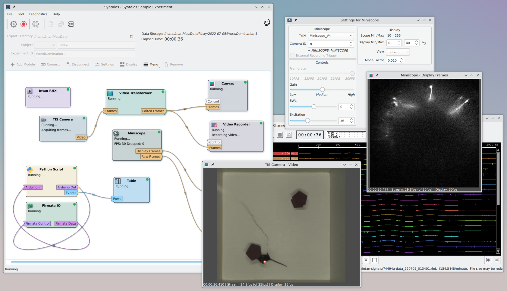

Syntalos
========

[](https://github.com/bothlab/syntalos/tree/master/contrib/screenshots)


Syntalos (formerly known as MazeAmaze) is a software for timestamp-synchronized parallel data acquisition from diverse data sources,
such as cameras, microendoscopes, Intan electrophysiology amplifiers or Firmata-based serial interfaces.
The software also allows closed-loop interventions via its built-in Python scripting support.
It is specifically designed for use in (neuro)scientific in vivo behavior experiments.

Syntalos is built with a set of core principles in mind:
 * Timestamps of all data sources of an experiment should be synchronized (within tolerance limits), so data at
   specific points in time can be directly compared. If hardware synchronization is unavailable, a software solution is used.
 * A data acquistion task must not block a different acquistion or processing task
 * Data is stored in a fixed directory structure (Experiment Directory Layout, EDL) with all metadata alongside the data
 * Account for experimenter error and have sane failure modes (autocorrect bad experimenter input, never have a component fail silently, ...)
 * Never auto-adjust parameters without logging the fact
 * Be Linux-native: Syntalos is written and used on Linux, which enables it to make use of some beneficial Linux-specific functionality
   to increase its robustness or performance (a Windows port is likely possible, but would need extensive testing).

## Modules

Syntalos modules are self-contained entities which can perform arbitrary data acquisition, processing and/or storage tasks.
All modules are supervised and driven by the Syntalos Engine and can communicate with each other using data streams.

Currently, the following modules are built-in or can be enabled at build-time:
 * *canvas*: An OpenGL-based display for single images and image streams. Will display frame times and framerates for interactive monitoring.
 * *camera-flir*: Use (USB) cameras from [FLIR Systems](https://www.flir.com/) which can be addressed via their Spinnaker SDK.
 * *camera-generic*: Use any camera compatible with UVC or the OpenCV videocapture abstraction (e.g. simple webcams).
 * *camera-tis*: Use a (USB) industrial camera from [The Imaging Source](https://www.theimagingsource.com/) to acquire a video stream.
 * *camer-ueye*: Record video with an uEye industrial camera from [IDS](https://ids-imaging.com) (this module is unmaintained!).
 * *firmata-io*: Control a (wired) serial device that speaks the [Firmata](http://firmata.org/wiki/Main_Page) protocol, usually an Arduino.
   This module can be controlled with a custom user script via the Python module.
 * *firmata-userctl*: Manually send commands to a *firmata-io* module to change pin states using a simple GUI.
 * *intan-rhx*: Use an [RHD2000 USB Interface Board](http://intantech.com/RHD2000_USB_interface_board.html) by [IntanTech](http://intantech.com/)
   for biopotential recordings of up to 256 channels.
 * *miniscope*: Perform calcium imaging in awake, freely moving animals using devices from the [UCLA Miniscope Project](http://miniscope.org/index.php/Main_Page).
 * *pyscript*: Run arbitrary Python 3 code and send automation commands to other modules in the active experiment.
 * *runcmd*: Run any external command when the experiment was started.
 * *table*: Display & record tabular data in a standardized CSV format.
 * *traceplot*: Plot long-running signal traces (usually recorded via the *intan-rhx* module).
 * *triled-tracker*: Track an animal via three LEDs mounted on a headstage and save various behavior parameters.
 * *videorecorder*: Record image streams from cameras to video files in various formats.

## Developers

### Dependencies

 * C++17 compatible compiler
   (GCC >= 7.1 or Clang >= 4. GCC is recommended)
 * Meson (>= 0.58)
 * Qt5 (>= 5.12)
 * Qt5 Test
 * Qt5 OpenGL
 * Qt5 SVG
 * Qt5 Remote Objects
 * Qt5 SerialPort
 * Qt5 Charts
 * GLib (>= 2.58)
 * Eigen3
 * [TOML++](https://github.com/marzer/tomlplusplus/)
 * FFmpeg (>= 4.1)
 * GStreamer (>= 1.0)
 * OpenCV (>= 4.1)
 * KF5 Archive
 * KF5 TextEditor
 * [pybind11](https://github.com/pybind/pybind11)
 * libusb (>= 1.0)

We recommend Debian 11 (Bullseye) or Ubuntu 20.04 (Focal Fossa) to run Syntalos,
but any Linux distribution that has a recent enough C++ compiler and Qt version
should work.

Some modules may add additional dependencies for libraries to talk to individual devices or for a certain special feature.
In case you get a dependency error when running `meson`, install the missing dependency or try to build with less modules enabled.

Before attempting to build Syntalos, ensure all dependencies (and their development files) are installed on your system.
If you are using Debian or Ubuntu, you may choose to locally run the system package installation script that the CI system uses:
`sudo ./tests/ci/install-deps-deb.sh`. *IMPORTANT:* This script runs APT with fsync/sync disabled to speed up package installation,
but this leaves the system vulnerable to data corruption in case of an unexpected power outage or other issues during installation.
If you are concerned by this, please install the packages mentioned in the script file manually.

After installing all dependencies, you should be able to build the software after configuring the build with Meson for your platform:
```sh
mkdir build && cd build
meson --buildtype=debugoptimized -Doptimize-native=true ..
ninja
sudo ninja install
```

Modules can be enabled and disabled via the `-Dmodules` flag - refer to `meson_options.txt` for a list of possible,
comma-separated values.

Pull-requests are very welcome! (Code should be valid C++17, use 4 spaces for indentation)

## Users

Currently, Syntalos needs to be compiled manually and we do not provide automatic binary builds yet.
This will likely change as the software matures and the 1.0 release is tagged - if you need help in
building Syntalos for your Linux distribution, don't hesitate to file a request for help as an issue.
